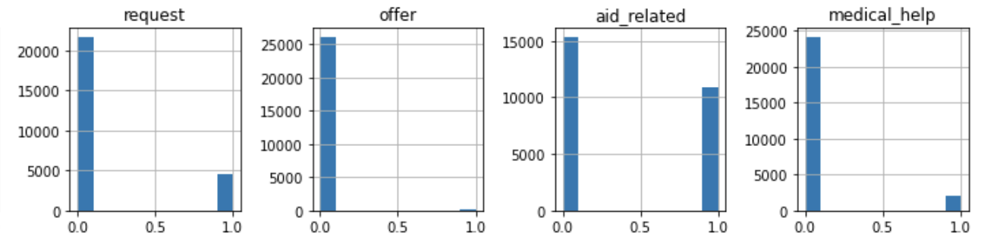

# Disaster Response Pipeline

## Table of contents

1. [Project motivation](#motivation)
2. [Installation](#installation)
3. [File description](#file)
4. [Deliverables](#deliverables)
5. [Instruction](#instruction)
6. [Acknowledgement](#acknowledgement)

## Motivation

For this project, I built pipelines that are ready for an API that will classifcy disaster messages into relevant categories.

The primary purpose of this project is to build ETL-pipeline and ML-pipeline. Therefore the model performance is not the focus.

## Installation

The code here basically run on the Anaconda distribution of Python (version 3.\*).

You need the following Python packages to install in order to run the app smoothly. The command to install in conda environemt is :

    conda install --channel conda-forge scikit-learn, nltk, sqlalchemy, pickle, flask, plotly

## File description

> `app` folder : files to run a flask web app.

> `data` folder  
>
> -   **etl_pipeline.py :** Python script to preprocess and store raw data
> -   **ETL_pipeline.ipynb :** Jupyter notebook to test codes for a ETL pipeline
> -   **DisasterResponse.db :** SQL database produced from the data pipeline
> -   **categories.csv**, **messages.csv** : Raw datasets

> `models`
>
> -   **train_classifier.py** : Python script used for a machine learning classification modeling
> -   **ML_pipeline.ipynb** : Jupyter notebook to test codes for a ML pipeline
> -   **classifier.pkl** : Pickle file that saves the trained model.

## Deliverables

The two Python scripts are written to operate data processing and modeling and ready to use for a web app built inside `app/run.py`

## Instructions

To run the app,

1.  Run the following commands in the root folder/repository

    **ETL pipeline to clean and store data**

        python data/etl_pipeline.py data/messages.csv data/categories.csv data/DisasterResponse.db

    **ML pipeline to train classifier and saves the model in pickle file**

        python models/train_classifier.py data/DisasterResponse.db models/classifier.pkl

2.  Run the following command in the `app` directory to run the app

        python run.py

3.  Type the below url on your browser to open the app

        http://0.0.0.0:3001

## Limitation

Disaster response messages can be classified into 36 categories. However, the given data (csv files) contain imbalanced proporation of values for a majority of features.

For example, a feature label `child_alone` does not have any data but only 0 values whereas many labels are extremely skewed to 0 binary number (negative) as seen in the figure below.

As a result, while evaluating the model, some labels produce true positive of 0 and f1 score calculation then returns zero division errors as recall and precision equals zero.

Therefore, the model may not be fully trained with the given data sets and require more data to feed in.

## Acknowledgement

This project is a part of Udacity's Data Scientist Nano Degree program.
Udacity provides the contents need to run the web app (`app` folder), and Figure Eight provided raw data in csv format.
